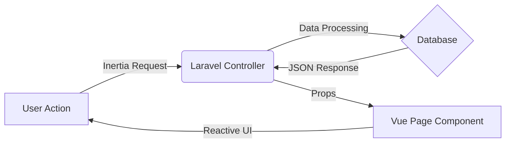

<h1 align="center">✦ OneForMind.</h1>

<p align="center">
  <i>The all-in-one productivity OS for growth, clarity, and control.</i>
</p>

<p align="center">
  
  
  
  
  
</p>

---

## 🧠 About

**OneForMind** is my personal holistic web platform designed to help regain control over daily life. Unlike fragmented tools, OneForMind integrates three core pillars of productivity into a single, seamless experience tailored to my specific workflow.

Key focus areas:

- 🌱 **Atomic Habits** — Build consistency through visual streaks.
- 💸 **Financial Clarity** — Track income & expenses without the headache.
- 📅 **Intentional Planning** — Organize days with purpose.

Built as a **Modern Monolith** using Laravel & Inertia to ensure speed, SEO friendliness, and a smooth SPA feel.

---

## ✨ Features

| Module | Description |
|------|------------|
| ⚡ **SPA Experience** | Seamless navigation via Inertia.js (No full reloads) |
| 🌍 **Multi-language (i18n)** | Dynamic translation support (ID/EN) |
| 📊 **Finance Hub** | CRUD optimized budgeting, expense tracking & visual stats |
| 🔥 **Habit Tracker** | Heatmaps, streaks, and gamified progress |
| 📱 **Responsive Design** | Mobile-first UI with Glassmorphism aesthetics |
| 🛡️ **Secure Auth** | Robust authentication & profile management |

---

## 🛠️ Tech Stack

```js
const stack = {
  backend: "Laravel 11",
  frontend: "Vue 3 (Composition API)",
  glue: "Inertia.js",
  styling: "Tailwind CSS + DaisyUI",
  database: "MySQL",
  tools: ["Vite", "Day.js", "Chart.js"],
};

```

---

## 📦 Project Structure

```txt
OneForMind
 ┣ 📂 app
 ┃ ┣ 📂 Http/Controllers   # Logic for Finance, Habits, etc.
 ┃ ┗ 📂 Models             # Eloquent Models
 ┣ 📂 resources/js
 ┃ ┣ 📂 Components         # Reusable UI (Cards, Modals)
 ┃ ┣ 📂 Composables        # Logic hooks (useFinanceForm, useFormat)
 ┃ ┣ 📂 Layouts            # Authenticated vs Guest layouts
 ┃ ┗ 📂 Pages              # Inertia Page Views
 ┣ 📂 routes               # Web routes definitions
 ┗ 📂 public               # Static assets & favicons

```

---

## 🎞️ System Philosophy

<sub>Data flows seamlessly between backend stability and frontend interactivity.</sub>



---

## 🚀 Roadmap / Upcoming

* [x] **Finance Module** (Optimized CRUD & Budgeting)
* [x] **Dashboard Revamp** (Glassmorphism UI)
* [ ] **Mobile App Integration** (Early Adopter Phase)
* [ ] **AI Insights** (For habit patterns)

---

<p align="center">
<sub>Private Project &copy; 2026 OneForMind. All Rights Reserved.</sub>
</p>
